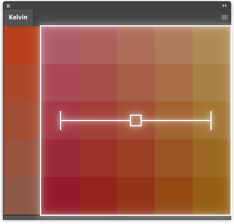
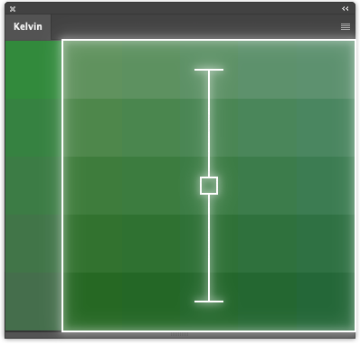
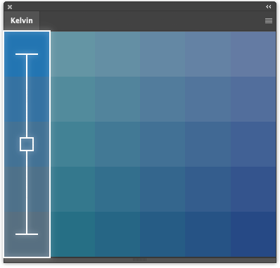

# Kelvin

Kelvin is a simple color selector that generates swatches of warmer and cooler colors based on your current foreground color. It's _very_ useful for dialling in the right shade, or for adding a bit of hue variation to a painting.

Your current foreground color is dead center. Cool variations of that color are to the left, warm variations are to the right.

Color variants desaturate as they brighten, and saturate as they darken.

Sometimes you want your colors to be bright _and_ saturated. In this special column, color variants saturate as they brighten, and desaturate as they darken. Again, your foreground color is dead center.

## Inspiration

I made extensive use of [Vasiliy Kuznetsov's Coldwarm plugin](https://github.com/vasiliy-kuznetsov/Coldwarm) back in the CS6 days, and wanted a version that would run on modern Photoshop.

## Installation

This requires Photoshop 2020 or newer. It _might_ work on Photoshop 2019, but that's not tested.

Download the latest `Kelvin.ZXP` file from the releases page. Install using your preferred ZXP manager.

If you'd like to install manually, clone this repository to your `Adobe/CEP/extensions` folder, and enable Photoshop's debug mode.

[Where to plonk my Adobe extensions?](https://creative-scripts.com/where-to-plonk-my-extensions/)

[Setting Cep Debug Mode and Log Level the Easy Way](https://creative-scripts.com/setting-cep-debug-and-log-level/)
